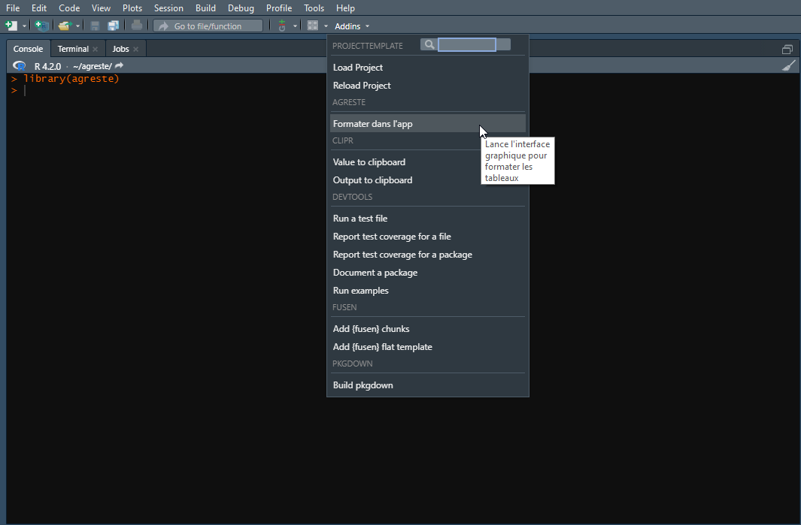

<!-- README.md is generated from README.Rmd. Please edit that file -->

# agreste

<div id="badges">


</div>

Le but du package agreste est de fournir à l’ensemble des agents du SSP
des outils pour faciliter la diffusion auprès du grand public. Le
package agreste propose de l’aide pour construire des tableaux. Il
facilite la création des documents attendus par la PAO (docx, xlsx) et
apporte des modèles de Rmarkdown.

## Installation

Vous pouvez installer le package agreste à partir du fichier
`agreste_1.1.1.tar.gz` :

``` r
remotes::install_local("C:/Users/killian.steunou/Downloads/chemin/agreste_1.1.1.tar.gz")
```

## Utilisation

Le package agreste a trois utilisations majeures :

-   La création d’un fichier Excel contenant les différents tableaux
    associés à une publication, formatés automatiquement selon le type
    de cette dernière (chiffres et données, primeur), à partir d’un plan
    de formatage :
    [`creer_excel_depuis_plan()`](reference/creer_excel_depuis_plan.html)
-   L’interface graphique intégrée qui permet de faciliter la création
    du fichier de plan évoqué ci-dessus :
    [`app_formatage()`](reference/app_formatage.html)
-   Ouvrir un modèle de RMarkdown, préformaté selon la publication :
    chiffres_et_donnees, primeur ou réponse à la demande

Vous pouvez démarrer l’interface graphique en utilisant l’*Addin*
intégré :


